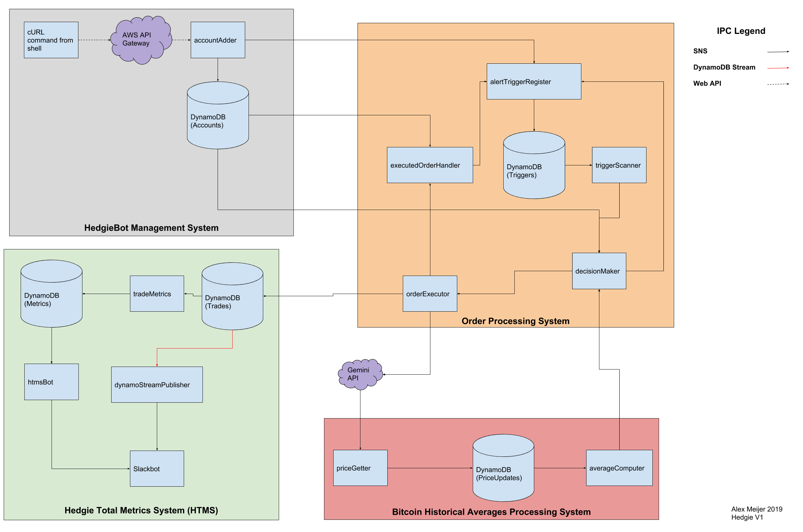

# Hedgie: A Serverless Bitcoin Trading Bot

## What is Hedgie?

Hedgie is a blue-sky engineering/research project in the design and implementation of bitcoin trading bots. It is designed to run a bitcoin trading algorithm on a serverless system and makes extensive use of the [Serverless Framework](https://serverless.com/). This version of Hedgie is designed to require a minimal amount of persistent state, with the idea that the bots make low frequency trades over long periods. It ships with a mock exchange function used for testing its operation without the hassle and danger of a real exchange account.

## Design Goals

The following design objectives guide the implementation of the software herein:

* Use of serverless technologies to minimize fixed cost
* Use of cloud databases for persistence
* Use of JS to improve proficiency in that language
* Polling based
* Relatively low frequency of trades
* Low operational costs

## High Level Architecture

See the attached architecture diagram [arch.png](arch.png) (reproduced above) for a high level modularized diagram. Hedgie is divided into four main components:

- The HedgieBot Management System controls the creation of an individual trading bot (a HedgieBot) which is colloquially referred to as an `account`. Each account represents some level of funds, and a strategy to use when trading those funds.

- The Order Processing System is the heart of the control loop that runs and executes a given bot's trading strategy. It is capable of running many bots simultaneously, to best allow the bot parameter space to be explored (with mock funding, of course!)

- The Bitcoin Historical Averages Processing system is a group of components that poll the bitcoin price from an external exchange api (in this case, Gemini), store them in a database, then compute the average price for a number of hours trailing into the past. This allows bots to implement strategies based on near or long term trends.

- The Hedgie Total Metrics System consists of a database containing metrics derived directly from the orders executed, before any post processing is done. This allows for accurate performance to be measured and monitored. For the purpose of notification and monitoring, a SlackBot has been built to announce trades, profitability of individual bots, and long term performance metrics.

The code implementing all of the sub-components of these modules is available in this source repository. Please note some proprietary logic has been scrubbed from the executedOrderHandler.

## Disclaimer

This software, as published here, is non functional. Two things are needed to get it to operate:

1. Serverless yaml files
    * These have many IAM details in them that I don't want to publish in case they are unintentionally insecure.
    * `serverless` will do a great job of boiler-plating yours, and you can determine the exact permissions you are comfortable with to add to it.
2. A trading algorithm
    * I think mine is unique to my goals and risk tolerances; everyone is different.
    * I leave it to the implementer to decide how they want their personal bot to trade

Furthermore, as explained in the license, this is HIGHLY EXPERIMENTAL SOFTWARE. Use at your own risk.

## LICENSE
See [LICENSE](LICENSE)

## Copyright

Copyright 2019 Alex Meijer, All Rights Reserved
